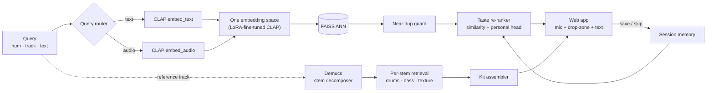

# 🎚️ Crate — Sound-Native Search & Discovery for Music Producers

**Hum it, drop a track, or describe it.** Crate searches a sample library by *sound*, not by text — all three query modes land in one contrastive embedding space, retrieve in under a second, and get re-ranked by your own digging taste. An agent can take a reference track, split it into drums / bass / texture stems, and search *per stem* to assemble a matching kit.

> "dusty boom-bap break but darker" — finally searchable.

**Live model:** [huggingface.co/jahnaviym/crate-clap-lora](https://huggingface.co/jahnaviym/crate-clap-lora) · **Code:** this repo

---

## Value proposition

Producers dig through 50K-sample libraries and Splice with **text** search — but the thing they want is a *sound*, not a word. Audio text-metadata is garbage, and everyone in the beatmaking community knows it. Crate makes the query modality **native to audio**: query-by-example that actually works for sound.

**Status quo:** sample search is filename/tag search. "Boom-bap break but darker," "reese but grittier," "that Dilla swing" — none of it is expressible in a text box over bad metadata. Producers resort to scrubbing through thousands of one-shots by ear.

**Product metrics:**
- **Relevance** — retrieval that understands producer vocabulary CLAP barely knows (*boom-bap, rimshot, tape-saturated*). Measured by recall@k vs base CLAP.
- **Latency** — sub-second search so digging stays in flow; a quantized encoder keeps per-clip embedding cheap.
- **Personalization** — your saves/skips train a taste head, so results bend toward what *you* keep.
- **Novel capability** — stem-granularity search (per-drums / per-bass / per-texture) that no text tool offers.

## Contributors

| Name | Responsible for | Commits |
|------|-----------------|---------|
| Jahnavi Yelamanchi | Full system — data, fine-tuning, retrieval, taste, agent, app, deploy | [commits](https://github.com/jahnavi-yelamanchi/crate/commits/main) |

---

## System diagram



## Summary of outside materials

| Material | What it is / how created | Conditions of use |
|----------|--------------------------|-------------------|
| **LAION-CLAP** (`laion/clap-htsat-unfused`) | Contrastive audio-text encoder (HTSAT audio tower + RoBERTa text tower), pretrained on large audio-caption corpora | Apache-2.0, open |
| **PEFT / LoRA** | Low-rank adapters — we fine-tune only the attention + projection layers (~1–2% of params) | Apache-2.0, open |
| **Demucs** (`htdemucs`) | Pretrained music source-separation model (Meta) | MIT, open — used as-is, not trained |
| **FAISS** | Facebook AI similarity search — ANN index (flat → IVF) | MIT, open |
| **Freesound** (data) | Community sound library; we pull **only CC0 / CC-BY** clips via the API, attribution tracked | CC0 / CC-BY (redistributable) |
| **ONNX Runtime** | int8 dynamic quantization + inference for the encoder latency benchmark | MIT, open |

## Infrastructure used

| Requirement | When / how much | Justification |
|-------------|-----------------|---------------|
| GPU (Colab T4) | ~1 session, LoRA fine-tune (12 epochs) + corpus embedding | CLAP forward pass on the corpus; LoRA itself is tiny (74K–2M params) |
| Local / M3 (MPS or CPU) | Inference, app serving, quantization benchmark | Model is light enough to serve on-device |
| Hugging Face Hub | 1 model repo (adapter) + 1 dataset repo (index artifacts) | Distribute the fine-tuned adapter; ship the prebuilt FAISS index to the demo |
| Docker | 1 container | Reproducible local/prod serving of the FastAPI app |

---

## Features

**Search, three ways — one embedding space**
- **Describe it** — "dusty boom-bap break but darker" → text query.
- **Hum it** — record via mic → audio query.
- **Drop / upload a track** — file → search by sound.

**Retrieval & ranking**
- **Sub-second ANN** over the corpus via FAISS (auto-switches flat → IVF above 100K clips).
- **Match %** per result (cosine similarity, relative to the top hit), inline **audio playback**, attribution + license.
- **Near-duplicate flood guard** — a pack with the same loop 12× won't dominate results.
- **Personal taste ranker** — Save (♥) / Skip (✕) train a logistic reco head; ranking blends `α·similarity + β·taste`, updated live from session memory.

**Agentic crate builder**
- Drop a reference track → **Demucs** splits it into drums / bass / texture → per-stem retrieval → assembled kit. Stem-granularity search is the move nobody else makes.

**Model**
- **LoRA fine-tune of CLAP** on producer vocabulary — beats base CLAP on held-out retrieval (see Results).
- **Quantized int8 encoder** + latency benchmark (ONNX Runtime).

**App / ops**
- FastAPI backend, single-page UI (mic + drop-zone + text), neubrutalist × editorial design, latency dashboard.
- Dockerized; one-command local run; optional HF Space deploy; free public demo via cloudflared tunnel.

---

## Implementation

### 1. Data pipeline — `crate/data/`
- **`freesound.py`** — API client, filters to CC0 / CC-BY (license is a URL), parallel downloads with 429 backoff, writes `metadata.jsonl`.
- **`packs.py`** — ingest local free sample packs, caption from folder/filename.
- **`preprocess.py`** — decode → 48 kHz mono, trim/pad to a fixed 10 s window, cache as `.npy` (parallelized).
- **`augment.py`** — label-preserving augmentation (pitch shift, time stretch, noise, EQ tilt) → positive contrastive pairs.
- **`pairs.py`** — join audio ↔ text (metadata + producer vocab), disjoint train / val / held-out splits.
- Orchestrated by `scripts/ingest.sh`.

### 2. Model training — `crate/model/` + `notebooks/01_train_lora.ipynb`
- **`encoder.py`** — CLAP wrapper: `embed_audio` / `embed_text` → L2-normalized vectors in one space.
- **`lora.py`** — PEFT LoRA fine-tune via CLAP's symmetric contrastive loss; `target_scope` = projection / attention / all. Best run: attention layers, 12 epochs.
- **`quantize.py`** — ONNX export + dynamic int8 + base-vs-int8 latency benchmark.
- Colab notebook trains and `push_to_hub`s the adapter; `scripts/publish_hf.py` writes the model card with the recall table.

### 3. Retrieval & ranking — `crate/index/`, `crate/rank/`
- **`build_index.py`** — embed the corpus with the fine-tuned encoder → FAISS (`IndexFlatIP`, IVF above 100K).
- **`search.py`** — query router (hum/track/text) → ANN top-k → near-duplicate guard.
- **`taste.py`** — save/skip event log, numpy logistic reco head, `α·sim + β·taste` rerank.
- **`distill.py`** — distills the two-stage ranker into one linear serving head (script provided).

### 4. Agent — `crate/agent/`
- **`router.py`** (modality) → **`stems.py`** (Demucs) → **`crate_builder.py`** (per-stem retrieval) → **`graph.py`** (`CrateAgent`, session memory feeding taste live).

### 5. Serving — `crate/app/`
- **`main.py`** — FastAPI: `/search`, `/crate`, `/save`, `/skip`, `/audio/{id}` (streams clips), `/latency`. Agent lazy-loads; missing artifacts return a clean 503.
- **`static/`** — single-page UI (mic record, drop-zone, text), playable results, model-card section.

### 6. Evaluation & monitoring — `eval/`
- **`recall_at_k.py`** — fine-tuned vs base CLAP on held-out pairs (run; see Results).
- **`parity.py`** — text-query vs audio-query top-k overlap (Jaccard).
- **`ab_taste.py`** — taste-ranked vs similarity-only (held-out AUC on logged sessions).
- **`failure_tests.py`** — bad/degraded hums, genre-vocab drift, near-duplicate flooding.

### 7. Deployment — Docker / HF Space / tunnel
- **`Dockerfile` + `docker-compose.yaml`** — reproducible local/prod serving.
- **`spaces/`** — HF Docker Space (`deploy_space.py`, one command).
- **`scripts/serve_colab.py`** — free public demo via cloudflared quick tunnel.

---

## Results — fine-tuned vs base CLAP

Held-out producer-vocabulary retrieval. LoRA on the attention layers, 12 epochs.

| metric | base CLAP | fine-tuned | lift |
|--------|-----------|------------|------|
| recall@1 | 0.21 | **0.40** | +93% |
| recall@5 | 0.58 | **0.87** | +50% |
| recall@10 | 0.75 | **0.95** | +27% |

---

## Quickstart

### A. Local (Python)
```bash
pip install -e ".[dev,stems]"
cp .env.example .env            # FREESOUND_KEY, HF_MODEL_REPO (+ HF_TOKEN)
bash scripts/ingest.sh          # pull licensing-clean audio → preprocess → pairs
python -m crate.index.build_index
uvicorn crate.app.main:app --reload   # http://localhost:8000
```

### B. Docker (recommended for deployment)
```bash
# needs ./data + ./models populated (run the pipeline once, or mount a prebuilt corpus)
cp .env.example .env            # set HF_MODEL_REPO=<you>/crate-clap-lora
docker compose up --build       # http://localhost:8000
```
The image installs everything (incl. Demucs + ffmpeg); `./data` and `./models` are mounted at runtime and the fine-tuned adapter is pulled from the Hub and cached.

### C. Train on Colab
Open `notebooks/01_train_lora.ipynb` (GPU) → sets Colab secrets → ingest → LoRA train → `push_to_hub`. Then `notebooks/02_build_index.ipynb` builds and exports the FAISS index.

### D. Free public demo
```bash
python scripts/serve_colab.py   # prints https://<...>.trycloudflare.com
```

---

## Project structure

```
crate/
├── Dockerfile, docker-compose.yaml   # containerized serving
├── crate/
│   ├── config.py                     # paths, model ids, audio params
│   ├── data/                         # freesound, packs, preprocess, augment, pairs
│   ├── model/                        # CLAP encoder, LoRA train, int8 quantize
│   ├── index/                        # FAISS build + query router / search
│   ├── rank/                         # taste reco head + distilled ranker
│   ├── agent/                        # router → stems → per-stem retrieve → kit + memory
│   └── app/                          # FastAPI + single-page UI
├── notebooks/                        # Colab: train LoRA, build index
├── eval/                             # recall, parity, taste A/B, failure tests
├── scripts/                          # ingest, publish_hf, deploy_space, serve_colab
├── spaces/                           # HF Docker Space
└── tests/                            # unit tests (CI: ruff + pytest)
```

## Failure testing

- **Bad hums** — heavily degraded audio (SNR < 0 dB); measure graceful recall decay vs clean.
- **Genre-vocab drift** — canonical term vs slang paraphrase ("boom-bap" vs "dusty 90s hip hop drums"); top-k overlap.
- **Near-duplicate flooding** — cosine-dedup guard keeps repeated loops out of the top-k (live + unit-tested).

## License

MIT. Audio data is licensing-clean (CC0 / CC-BY from Freesound + free packs); attributions tracked in `data/metadata.jsonl`.
